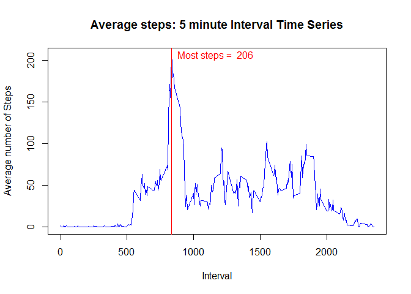

# Reproducible Research: Peer Assessment 1


## Loading and preprocessing the data


```r
## Additional libraries called in this exercise.
library(plyr)
library(lattice)

activity <- read.csv("activity.csv",sep = ",", header=TRUE)
activity$date <- as.Date(activity$date)
totalsteps <- ddply(activity, "date", function(x) sum(x$steps))
hist(totalsteps$V1, breaks = 6,
        col = "lightblue",
        main = paste("Histogram of the total number of steps taken each day"),
        xlab = " Number of steps")
        abline(v=mean(totalsteps$V1, na.rm = TRUE), lty=1, col="green")
        abline(v=median(totalsteps$V1, na.rm = TRUE), lty=2, col="red")
        text(mean(totalsteps$V1, na.rm = TRUE),5,labels="mean", pos=4, col="green")
        text(median(totalsteps$V1, na.rm = TRUE),3,labels="median", pos=4, col="red")
```

 

## What is mean total number of steps taken per day?

```r
print(paste("The mean is = ", mean(totalsteps$V1, na.rm = TRUE)))
```

```
## [1] "The mean is =  10766.1886792453"
```

## What is the average daily activity pattern?


```r
avgStepsInt <- aggregate(steps ~ interval, data = activity, mean, na.rm = TRUE)  
plot(avgStepsInt, type="l",  
        main="5 minute Interval Time Series", 
        ylab="Average number of Steps", 
        xlab="Interval", col="blue") 
abline(v=avgStepsInt$interval[avgStepsInt$steps >= max(avgStepsInt$steps)], lty = 1, col = "red")
        text(x = avgStepsInt$interval[avgStepsInt$steps >= max(avgStepsInt$steps)],y = round(max(avgStepsInt$steps)),   
        labels=paste("Most steps = ",(round(max(avgStepsInt$steps)))), 
          pos = 4, col = "red")
```

 

## Inputing missing values


```r
print(paste("Count of enties with missing values is",length(activity$steps[is.na(activity$steps)])))
```

```
## [1] "Count of enties with missing values is 2304"
```


```r
fillNAsteps <- function(interval) {
        avgStepsInt[avgStepsInt$interval == interval, ]$steps
}

activityAll <- activity  
count = 0  
for (i in 1:nrow(activityAll)) {
        if (is.na(activityAll[i, ]$steps)) {
                activityAll[i, ]$steps <- fillNAsteps(activityAll[i, ]$interval)
                count = count + 1
        }
}
print(paste("Total of", count, "NA values update."))
```

```
## [1] "Total of 2304 NA values update."
```

```r
totalsteps2 <- ddply(activityAll, "date", function(x) sum(x$steps))
hist(totalsteps2$V1, breaks = 6,
     col = "lightblue",
     main = paste("Histogram of the total number of steps taken each day"),
     xlab = " Number of steps")
abline(v=mean(totalsteps2$V1), lty=1, col="green")
abline(v=median(totalsteps2$V1), lty=2, col="red")
text(mean(totalsteps2$V1),5,labels="mean", pos=4, col="green")
text(median(totalsteps2$V1),3,labels="median", pos=4, col="red")
```

 

# The mean total number of steps taken per day


```r
print(paste("The mean is = ", mean(totalsteps2$V1)))
```

```
## [1] "The mean is =  10766.1886792453"
```

## Are there differences in activity patterns between weekdays and weekends?


```r
activityAll$day <- weekdays(activityAll$date)

for (i in 1:nrow(activityAll)) {                                       
        if (activityAll[i,]$day %in% c("Saturday","Sunday")) {            
                activityAll[i,]$day<-"weekend"                                
        }
        else{
                activityAll[i,]$day<-"weekday"                                
        }
}

totalsteps3 = aggregate(steps ~ interval + day, activityAll, mean)
library(lattice)
xyplot(steps ~ interval | factor(day), data = totalsteps3, aspect = 1/2, type = "l")
```

 

## The mean number of steps for weekdays and weekend:


```r
aggregate(totalsteps3$steps, list(totalsteps3$day), mean)
```

```
##   Group.1        x
## 1 weekday 35.61058
## 2 weekend 42.36640
```
